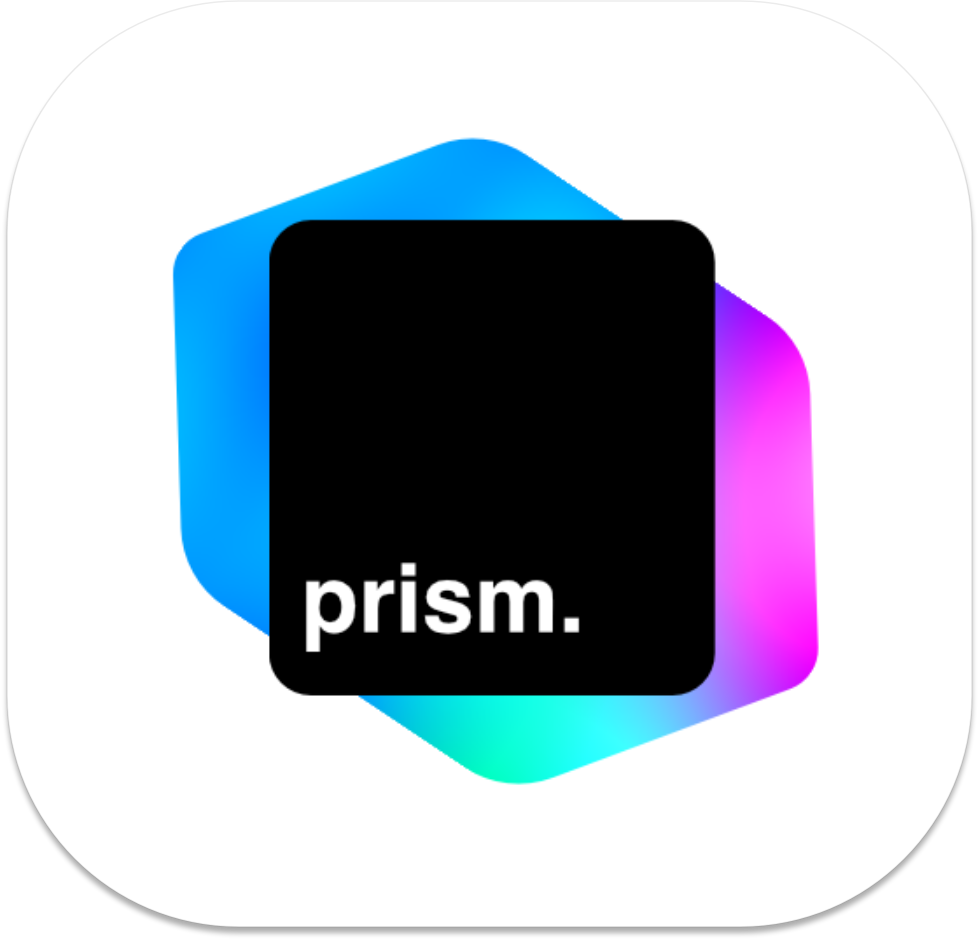

<div align="center">
  <a href="https://github.com/nulzo/prism">
    
  </a>
</div>

# Prism

Ultra-fast, low-latency, self-hostable AI gateway.

## Installation

todo... using with docker

## Text-to-Speech (TTS)

Prism supports generating audio from text using the standard API shape. Current support:
- **ElevenLabs**
- **CosyVoice**
- **Qwen3-TTS**

### Usage

To generate audio, send a standard chat completion request with the `modalities` and `audio` fields configured. The response will contain a base64-encoded audio string in the `audio.data` field.

```bash
curl -X POST http://localhost:8081/v1/chat/completions \
  -H "Content-Type: application/json" \
  -H "Authorization: Bearer <your-api-key>" \
  -d '{
    "model": "elevenlabs/JBFqnCBsd6RMkjVDRZzb",
    "messages": [
      {
        "role": "user",
        "content": "Hello! This is a test of the text-to-speech system."
      }
    ],
    "modalities": ["text", "audio"],
    "audio": {
      "format": "mp3_44100_128"
    }
  }'
```

### Provider Configurations

Add the following to your `config.yaml` to enable the TTS providers:

```yaml
providers:
  - id: elevenlabs
    type: elevenlabs
    name: ElevenLabs
    api_key: "your-elevenlabs-key"
    enabled: true
  - id: cosyvoice
    type: cosyvoice
    name: CosyVoice
    base_url: "http://localhost:50000" # Default CosyVoice FastAPI port
    enabled: true
  - id: qwen3
    type: qwen3
    name: Qwen3-TTS
    base_url: "http://localhost:8000/v1" # Default vLLM-Omni port
    enabled: true
```